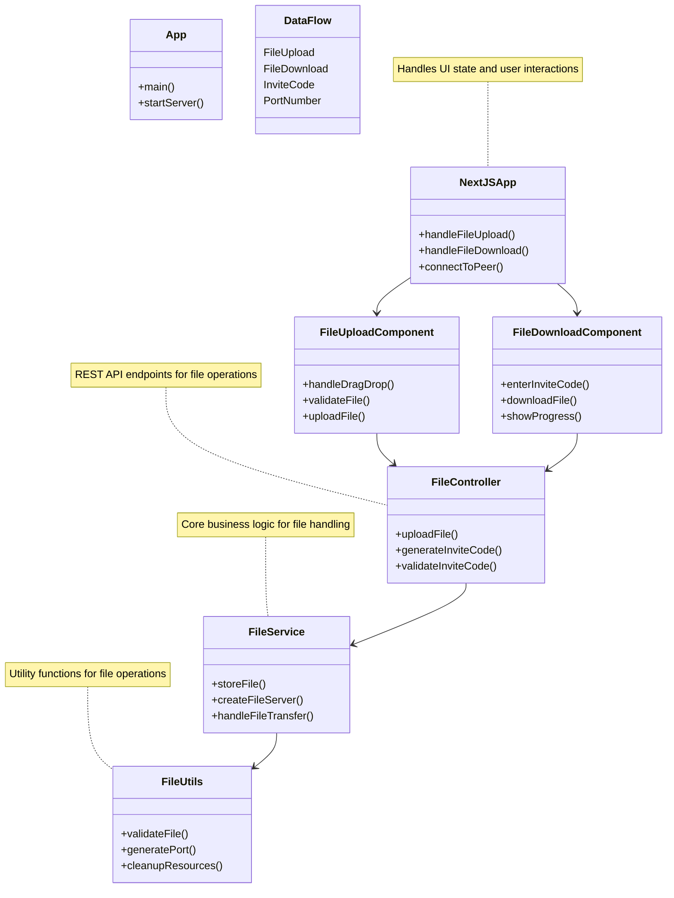

# Portshare

Portshare is a lightweight file sharing application that lets users upload a file and share it with others using a simple invite code. The project combines a Java backend with a modern Next.js frontend to provide a straightforward file transfer experience.

---

## Overview

Portshare focuses on making file sharing quick and frictionless:

* Upload files through a drag-and-drop interface
* Receive a generated invite code
* Share the code with another user
* Download the file using the provided code


---

## Project Layout

### Backend

Located in:

```text
src/main/java/portshare
```

Key modules:

```text
App.java                Application bootstrap
controller/             API endpoints
service/                Core business logic
utils/                  Helper utilities
```

### Frontend

Located in:

```text
ui/
```

Important directories:

```text
src/app                 Next.js App Router pages
src/components          Reusable React components
```

---

## Requirements

Before running the project, make sure the following tools are installed:

| Dependency | Version                     |
| ---------- | --------------------------- |
| Java       | 11 or newer                 |
| Node.js    | 18 or newer                 |
| npm        | Latest recommended          |
| Maven      | Required for backend builds |

---

# Running the Application

## Quick Launch

### Linux / macOS

```bash
./start.sh
```

### 

These scripts handle:

1. Building the backend
2. Starting the Java server
3. Launching the frontend development environment

---

## Manual Setup

### Backend

Build the project:

```bash
mvn clean package
```

Start the server:

```bash
java -jar target/portshare-1.0-SNAPSHOT.jar
```

By default, the backend listens on:

```text
http://localhost:8080
```

---

### Frontend

Install dependencies:

```bash
cd ui
npm install
```

Start the development server:

```bash
npm run dev
```

The web interface will be available at:

```text
http://localhost:3000
```

---

# File Sharing Workflow

## 1. Upload

* A user selects or drags a file into the application
* The frontend sends the file to the backend
* The backend registers the file and generates a unique sharing code

## 2. Share

* The generated code is displayed to the uploader
* The code can be shared with another user through any communication channel

## 3. Download

* The recipient enters the code into the application
* The backend validates the code
* The associated file is served to the recipient for download

---

# System Architecture

The application consists of a frontend, a backend API layer, and the file recipient.

```text
┌─────────────┐      ┌─────────────┐      ┌─────────────┐
│             │      │             │      │             │
│  Next.js UI │◄────►│ Java Server │◄────►│ Peer Device │
│             │      │             │      │             │
└─────────────┘      └─────────────┘      └─────────────┘
```

### Component Responsibilities

| Component        | Responsibility                             |
| ---------------- | ------------------------------------------ |
| Next.js UI       | User interactions and file operations      |
| Java Server      | File handling, code generation, validation |
| Recipient Device | Retrieves shared files using invite codes  |

---

# Low-Level Design



---

## Backend Components

### App

Responsible for application startup and server initialization.

### FileController

Exposes HTTP endpoints for:

* Uploading files
* Generating invite codes
* Validating download requests

### FileService

Contains the application's core logic:

* File management
* Transfer orchestration
* Download handling

### FileUtils

Utility functionality including:

* Validation helpers
* Port allocation
* Resource cleanup

---

## Frontend Components

### NextJSApp

Top-level application component responsible for:

* State management
* User interactions
* Coordination between UI modules

### FileUploadComponent

Handles:

* Drag-and-drop uploads
* File validation
* Upload requests

### FileDownloadComponent

Handles:

* Invite code entry
* Download requests
* Progress reporting

---

## Security Considerations -

This is a demo application and does not include encryption or authentication. For production use, consider adding:
 - File encryption
 - User authentication
 - HTTPS support
 - Port validation and security

---

# Deployment


Example deployment options include:

* Local network environments
* Docker and Docker Compose
* VPS hosting
* Cloud platforms such as Railway, Vercel, Netlify, and similar services

---

# License

Released under the MIT License.
